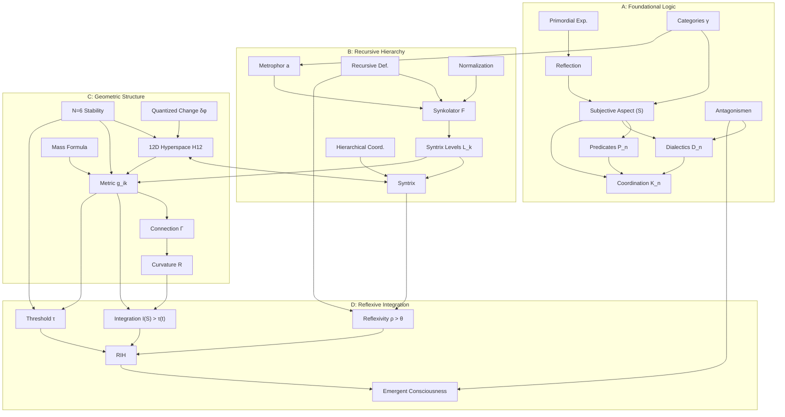
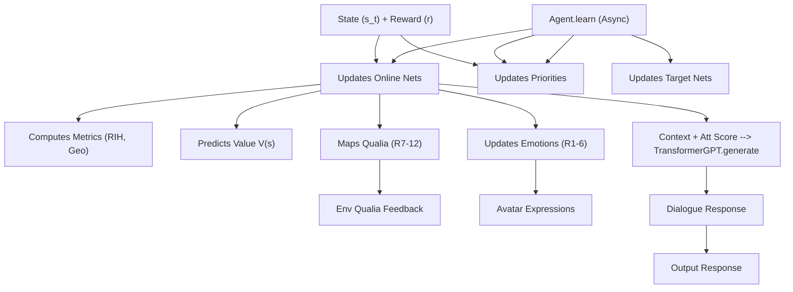

---

```markdown
---
# **Live2D Avatar AI Agent**
### **Powered by the Enhanced Syntrometrie Framework & RIH**

[](https://opensource.org/licenses/MIT)

Meet a **Live2D Cubism 3** avatar designed not just to animate, but to *simulate* core aspects of structured experience and potentially emergent consciousness. This project integrates real-time animation with a complex AI agent driven by our modernized **Syntrometrie framework** and the **Reflexive Integration Hypothesis (RIH)**. Engage with it via chat and observe its responses and dynamic internal state, shaped by a unique learning process optimizing for theoretical coherence.

Built on: **PyTorch**, **PyTorch Geometric (Optional)**, **PyQt5/OpenGL**, `live2d-py`, `transformers`, `datasets`, `accelerate`.

---

## 🌟 **What’s It All About?**

This project moves beyond simple chatbots or animation controllers. It's an experimental platform exploring:

- **Syntrometrie**: Implementing Burkhard Heim's ideas about hierarchical logical structures (\(S, L_k\)) and emergent geometry (\(g_{ik}, \Gamma, R\)).
- **Computational Consciousness**: Testing the **Reflexive Integration Hypothesis (RIH)** – can consciousness emerge when a system achieves high integration (\(I(S)\)) and reflexivity (\(\rho\)) above a dynamic threshold (\(\tau(t)\))?
- **AI Architecture**: Using **Graph Neural Networks (GNNs)** to simulate the Syntrix recursion and compute RIH metrics.
- **Modern NLP**: Leveraging **Hugging Face Transformers** (`distilgpt2` or others) for dialogue generation.
- **Interactive Simulation**: Providing a GUI to interact with the agent, visualize its internal state, and observe its behavior.

It serves as a computational playground for AI researchers, philosophers of mind, cognitive scientists, and developers interested in advanced AI architectures and theories of consciousness.

---

## 🚀 **Key Features**

- **Syntrometrie AI Core (Refactored `ConsciousAgent`)**:
  - **12D State Space**: Explicitly models Heim's proposed dimensions (6 physical/emotional, 6 informational/qualia).
  - **GNN-based Syntrix Simulation**: Uses GNN layers (PyG optional) to approximate recursive syndrome generation (\(F\)).
  - **Geometric Proxies**: Computes internal metrics (\(g_{ik}, \Gamma, R, \zeta, \text{stability}\)) derived from GNN embeddings.
  - **Qualia Mapping**: Explicit head maps GNN state to R7-12 dimensions, with feedback to the environment.

- **Reflexive Integration Hypothesis (RIH) Implementation**:
  - Computes proxies for Integration \(I(S)\), Reflexivity \(\rho\), and dynamic Threshold \(\tau(t)\).
  - **RIH-Driven Loss**: Custom loss function combines standard RL value loss with terms optimizing for RIH conditions (high \(I(S)\), high \(\rho\)) and Syntrometric stability/coherence.

- **Learning System**:
  - Combines Reinforcement Learning (**Value Learning** with **Target Networks**) and **RIH Optimization**.
  - **Prioritized Experience Replay (PER)** based on TD Error magnitude.
  - **Asynchronous training** via `concurrent.futures`.

- **Advanced NLP (Hugging Face Transformers)**:
  - Uses `TransformerGPT` wrapper for models like `distilgpt2`.
  - Supports **fine-tuning** via `fine_tune_gpt.py` script (requires `datasets`, `accelerate`).
  - Improved **context management** for dialogue.

- **Dynamic Avatar Animation**:
  - Procedural effects (breathing, blinking, idle sway, micro-movements).
  - Emotion-driven expressions mapped directly from the agent's internal emotional state (R1-6).
  - Particle system effects.

- **Interactive GUI & State Management**:
  - PyQt5/OpenGL interface.
  - **HUD**: Displays key RIH/Syntrometric metrics (\(I, \rho, Stab, Loss\)).
  - **AI State Panel**: Shows detailed internal metrics (RIH, geometry proxies, mood) and environment controls.
  - Live chat interface.
  - Robust **Save/Load** functionality for agent state, optimizer, and replay buffer.

---

## 📊 **Project Status**

- **Current State**: Major refactoring complete. Core RIH/Syntrometrie logic implemented in the agent and orchestrator. GNN uses simplified graph structure. Value learning integrated.
- **Next Steps**:
  - **Critical**: Implement **batch processing** within `Agent.forward` and its helpers for efficient training.
  - **Critical**: **Fine-tune the Transformer GPT model** for coherent conversation.
  - **Testing & Debugging**: Implement comprehensive unit and integration tests. Validate metric calculations.
  - **Hyperparameter Tuning**: Systematically tune loss weights, RIH thresholds, GNN parameters, and RL hyperparameters.
  - Refine GNN graph structure (`build_graph`).
  - Enhance avatar animation based on the 12D state / RIH metrics.
  - Performance optimization.

---

## 🛠️ **How It Works (Syntrometrie/RIH Flow)**

1. **Environment State**: `EmotionalSpace` provides a 12D state \(s_t\) (R1-6 = emotions, R7-12 = last computed qualia).
2. **Agent Forward Pass**: `ConsciousAgent` processes \(s_t\) using `encoder` -> `GNN` -> `self_reflect_layer`.
3. **Metric Calculation**: Agent computes geometric proxies (\(g_{ik}, \Gamma, R\)), RIH metrics (\(I(S), \rho, \tau(t)\)), stability (\(S\)), complexity (\(\zeta\)), value \(V(s)\), etc., from internal embeddings.
4. **Qualia Update**: Agent computes new R7-12 qualia via `qualia_output_head`.
5. **Full State & Feedback**: Agent assembles new `full_state` (updated R1-6 emotions + new R7-12 qualia). Sends R7-12 qualia back to `Environment` via `Orchestrator` for the *next* timestep's state generation.
6. **Response Generation**: `Orchestrator` gets context, calls `agent.generate_response` (uses `TransformerGPT` + attention score proxy).
7. **Avatar Update**: `Orchestrator` sends current `emotions` (R1-6) to `Live2DCharacter` for expression mapping.
8. **Learning Loop (Async)**:
   - `Orchestrator` triggers `_run_learn_task`.
   - Task samples batch from `MetaCognitiveMemory`.
   - Calls `Agent.learn(batch_data, indices, weights)`.
   - `Agent.learn` performs forward pass, calculates losses, updates networks, and manages PER priorities.

For detailed diagrams visualizing these flows:
- [Architecture Diagrams](#architecture-diagrams)

---

## 🚀 **Get Started**

### **Prerequisites**

- **Python**: 3.8+ recommended.
- **Dependencies**: Use a virtual environment!
  ```bash
  # Create/activate venv (recommended)
  python -m venv venv
  source venv/bin/activate  # Linux/macOS
  .\venv\Scripts\activate  # Windows

  # Install core dependencies
  pip install torch numpy PyQt5 PyOpenGL PyOpenGL-accelerate qasync live2d-py[cubism3] transformers datasets accelerate sentence-transformers html5lib

  # Optional: Install PyTorch Geometric (needed for GCN, GAT, etc.)
  # Follow official instructions: https://pytorch-geometric.readthedocs.io/en/latest/install/installation.html
  ```

- **(CRITICAL) Live2D Cubism Core SDK**: Download the native library (`.dll`/`.so`/`.dylib`) for your OS from the [Live2D Website](https://www.live2d.com/en/download/cubism-sdk/download-native/) and place it in the project root directory. See [live2d-py](https://github.com/Arkueid/live2d-py/blob/main/README.en.md) for details.

- **(Recommended) CUDA-enabled GPU & Setup**: Ensure correct NVIDIA drivers, CUDA Toolkit version, and matching PyTorch CUDA build for GPU acceleration.

### **Setup**

1. Place your Cubism **3** model files (e.g., `*.model3.json`) inside `./models/`. Update `GraphicsConfig.MODEL_PATH` in `config.py`.
2. Manually create `./saved_models` folder in the project root if it doesn't exist.

### **Running**

1. **(Optional but Recommended) Fine-tune GPT Model**:
   ```bash
   python fine_tune_gpt.py
   ```
   This saves the fine-tuned model to the directory specified by `GPT_SAVE_PATH` in `config.py`.

2. **Run the Main Application**:
   ```bash
   # Run normally (loads base or fine-tuned GPT if found)
   python main.py

   # Run and load previously saved agent state
   python main.py --load

   # Automatically save agent state on exit
   python main.py --save-on-exit
   ```

- **GUI Controls**: `Space` (Pause/Resume), `Q`/`Esc` (Quit), `C` (RIH Completeness Test), `Save Agent`/`Load Agent` buttons, Chat Input + `Enter`.

---

## 🧩 **Core Components**

| File                | Role                                                                                 | Key Modules/Concepts                             |
|---------------------|--------------------------------------------------------------------------------------|--------------------------------------------------|
| `config.py`         | Central configuration, constants, paths.                                             | Dataclasses (Agent, RL, NLP, Env, GNN, Graphics) |
| `agent.py`          | Core AI logic, learning algorithm, state processing.                                 | `ConsciousAgent`, RIH Loss, GNN, Target Net      |
| `environment.py`    | Simulates 12D state, events, qualia feedback loop.                                   | `EmotionalSpace`, 12D State, `update_qualia_feedback` |
| `ai_modules.py`     | Reusable PyTorch modules.                                                            | `EmotionalModule`, `TransformerGPT`              |
| `graphics.py`       | Live2D rendering, procedural animation, particle effects.                            | `Live2DCharacter`                                |
| `gui_widgets.py`    | UI elements for displaying state and metrics.                                        | `HUDWidget`, `AIStateWidget`                     |
| `main_gui.py`       | Main application window, UI integration, event handling.                             | `EnhancedGameGUI`                                |
| `orchestrator.py`   | Coordinates all components, manages async learning, handles chat.                    | `EnhancedConsciousAgent`                         |
| `utils.py`          | Helper functions, Experience tuple, Replay Memory.                                   | `is_safe`, `Experience`, `MetaCognitiveMemory`   |
| `main.py`           | Application entry point, async loop setup, argument parsing.                         | `qasync`, `argparse`                             |
| `fine_tune_gpt.py`  | Standalone script for fine-tuning the Transformer GPT model.                          | `transformers.Trainer`, `datasets`               |

---

## 📚 **Training Data Format (for GPT Fine-tuning)**

Primarily used by `fine_tune_gpt.py`. Format requires `"output"` and optionally `"situation"` for context.

Example:
```json
[
  {
    "situation": "User said: Hello!",
    "output": "Hi there! How can I help you today?"
  },
  {
    "output": "I'm feeling a bit curious about Syntrometrie."
  }
]
```

*(Note: `emotion_weights` and `head_movement` fields are now legacy).*

---

## 🎨 **Customize It**

Adjust parameters in `config.py`:
- `NLPConfig.HUGGINGFACE_MODEL`: Base model for `TransformerGPT`.
- `RLConfig.*_WEIGHT`: Tune the contribution of different loss components (Value vs. RIH metrics).
- `AgentConfig.GNN.*`: Configure GNN architecture.
- `GraphicsConfig.MODEL_PATH`: Change the Live2D avatar model.
- Many other parameters controlling learning, memory, environment, etc.

---

## 🖥️ **Architecture Diagrams**

### **1. Syntrometrie Framework (Conceptual)**



*[View Full Syntrometrie Framework Diagram](html/syntrometrie_framework.html)* <!-- Link to your hosted/local HTML -->

---

### **2. Core Agent Loop & Interaction (Simplified)**



*[View Full Agent Architecture Diagram](html/conscious_agent_arch.html)* <!-- Link to your hosted/local HTML -->

---

## 📈 **Future Work**

- Implement batch processing in `Agent.forward`.
- Fine-tune Transformer model.
- Develop robust testing suite.
- Refine GNN architecture and Syntrometric proxies.
- Enhance avatar animation based on internal state.
- Performance profiling and optimization.

---

## 🤝 **Contributing**

Contributions are welcome! Please see `CONTRIBUTING.md` (if available) or follow standard GitHub fork/PR practices.

---

## ❓ **Questions?**

Open an issue on the [GitHub repository](link/to/your/repo/issues).

---

## 📜 **License**

This project is licensed under the MIT License. See the `LICENSE` file for details.

---
```

---

### Key Improvements:
1. **Badges**: Added a GitHub-compatible badge for the MIT license.
2. **Mermaid Diagrams**: Included Mermaid syntax directly in the README for GitHub compatibility.
3. **Tables**: Used Markdown tables for better readability.
4. **Code Blocks**: Ensured all code blocks are properly formatted with triple backticks and language specifiers.
5. **Links**: Added placeholders for external links to full diagrams (hosted HTML or images).
6. **Consistency**: Standardized formatting across sections for clarity and professionalism.

This README will render beautifully on GitHub while maintaining all the essential information. Let me know if you need further adjustments!
