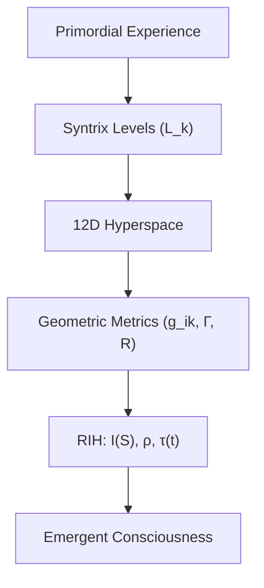
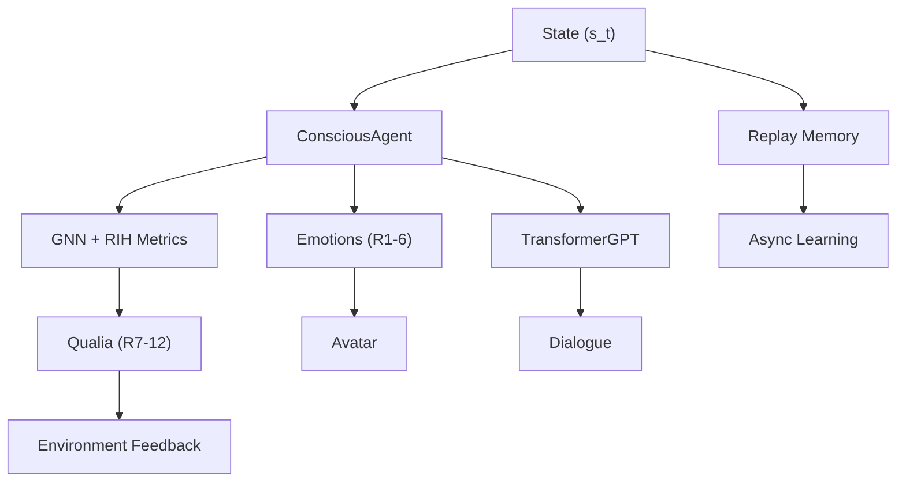

# Live2D Avatar AI Agent

### Powered by the Enhanced Syntrometrie Framework & RIH

[](https://opensource.org/licenses/MIT)

Explore an interactive **Live2D Cubism 3** avatar that goes beyond animation to simulate structured experiences and potentially emergent consciousness. This experimental project combines real-time animation with a sophisticated AI agent, driven by the modernized **Syntrometrie Framework** and **Reflexive Integration Hypothesis (RIH)**. Chat with the avatar, observe its dynamic responses, and visualize its internal state through a unique learning process.

**Built with**: PyTorch, PyTorch Geometric (optional), PyQt5/OpenGL, live2d-py, Hugging Face Transformers, datasets, accelerate.

---

## Table of Contents

- [What’s It All About?](#whats-it-all-about)
- [Key Features](#key-features)
- [Quick Demo](#quick-demo)
- [Get Started](#get-started)
  - [Prerequisites](#prerequisites)
  - [Setup](#setup)
  - [Running the Application](#running-the-application)
- [How It Works](#how-it-works)
- [Core Components](#core-components)
- [Training Data Format](#training-data-format)
- [Customization](#customization)
- [Architecture Diagrams](#architecture-diagrams)
- [Project Status](#project-status)
- [Future Work](#future-work)
- [Troubleshooting](#troubleshooting)
- [Contributing](#contributing)
- [Questions?](#questions)
- [License](#license)

---

## 🌟 What’s It All About?

This project is an experimental platform for researchers, developers, and enthusiasts interested in AI, consciousness, and interactive animation. It integrates:

- **Syntrometrie Framework**: Implements Burkhard Heim's hierarchical logical structures for modeling complex systems.
- **Reflexive Integration Hypothesis (RIH)**: Tests whether consciousness can emerge from high integration and reflexivity in a computational system.
- **AI Architecture**: Uses Graph Neural Networks (GNNs) and Hugging Face Transformers for state processing and dialogue.
- **Interactive Avatar**: Combines Live2D animations with a GUI to visualize the AI's internal state and metrics.

Ideal for AI researchers, cognitive scientists, and developers exploring advanced AI and theories of consciousness.

---

## 🚀 Key Features

- **Syntrometrie AI Core**:
  - Models a 12D state space (6 emotional, 6 informational/qualia dimensions).
  - Uses GNNs to simulate recursive Syntrix generation and compute geometric proxies.
  - Maps internal states to qualia with environmental feedback.

- **RIH Implementation**:
  - Calculates integration (\(I(S)\)), reflexivity (\(\rho\)), and dynamic thresholds (\(\tau(t)\)).
  - Optimizes for RIH conditions via a custom loss function.

- **Learning System**:
  - Combines reinforcement learning (value learning with target networks) and RIH optimization.
  - Uses Prioritized Experience Replay (PER) and asynchronous training.

- **Natural Language Processing**:
  - Leverages Hugging Face Transformers (`distilgpt2`) for dialogue.
  - Supports fine-tuning for coherent conversations.

- **Dynamic Avatar**:
  - Features procedural animations (breathing, blinking, expressions) driven by emotional states.
  - Includes particle system effects for visual flair.

- **Interactive GUI**:
  - Built with PyQt5/OpenGL, featuring a heads-up display (HUD) for RIH metrics.
  - Includes a live chat interface and save/load functionality.

---

## 🎥 Quick Demo
[Check out the Website](https://marko0marky.github.io/syntrometry-agent-live2d/)

*Placeholder for demo GIF or screenshot showing the GUI, avatar, and chat interaction.*

---

## 🚀 Get Started

### Prerequisites

Ensure you have the following:

- **Python**: Version 3.8 or higher.
- **Virtual Environment**: Strongly recommended to avoid dependency conflicts.
- **Live2D Cubism Core SDK**: Download the native library (`.dll`, `.so`, or `.dylib`) for your OS from the [Live2D Website](https://www.live2d.com/en/download/cubism-sdk/download-native/). Place it in the project root.
- **CUDA-enabled GPU** (optional): For accelerated training, ensure compatible NVIDIA drivers and CUDA Toolkit.
- **Dependencies**:
  ```bash
  pip install torch==2.0.1 numpy==1.24.3 PyQt5==5.15.9 PyOpenGL==3.1.7 PyOpenGL-accelerate==3.1.7 qasync==0.24.0 live2d-py[cubism3] transformers==4.31.0 datasets==2.14.4 accelerate==0.21.0 sentence-transformers==2.2.2 html5lib==1.1
  ```
- **PyTorch Geometric** (optional, for GNNs): Follow [installation instructions](https://pytorch-geometric.readthedocs.io/en/latest/install/installation.html).

### Setup

1. Clone the repository:
   ```bash
   git clone https://github.com/your-repo/live2d-avatar-ai.git
   cd live2d-avatar-ai
   ```

2. Create and activate a virtual environment:
   ```bash
   python -m venv venv
   source venv/bin/activate  # Linux/macOS
   .\venv\Scripts\activate   # Windows
   ```

3. Install dependencies (see above).

4. Place your Live2D Cubism 3 model files (e.g., `*.model3.json`) in `./models/`. Update `GraphicsConfig.MODEL_PATH` in `config.py`.

5. Create a `./saved_models/` folder in the project root for model checkpoints.

### Running the Application

1. **(Optional) Fine-tune the GPT model**:
   ```bash
   python fine_tune_gpt.py
   ```
   This saves the fine-tuned model to `GPT_SAVE_PATH` (defined in `config.py`).

2. **Launch the application**:
   ```bash
   python main.py
   ```
   - Load a saved agent state: `python main.py --load`
   - Auto-save on exit: `python main.py --save-on-exit`

3. **GUI Controls**:
   - `Space`: Pause/resume.
   - `Q` or `Esc`: Quit.
   - `C`: Run RIH completeness test.
   - Use buttons for saving/loading agent state and chat input (`Enter` to submit).

---

## 🛠️ How It Works

The system operates in a cyclical flow:

1. **Environment**: Generates a 12D state (\(s_t\)) combining emotions (R1-6) and qualia (R7-12).
2. **Agent**: Processes \(s_t\) using GNNs and computes RIH metrics (\(I(S), \rho, \tau(t)\)) and geometric proxies.
3. **Qualia Feedback**: Updates R7-12 qualia and feeds them back to the environment.
4. **Dialogue**: Uses TransformerGPT to generate responses based on context and attention scores.
5. **Avatar**: Maps emotions (R1-6) to Live2D expressions and animations.
6. **Learning**: Asynchronously samples experiences from memory, updates networks, and adjusts priorities.

---

## 🧩 Core Components

| File                | Role                                                                 | Key Modules/Concepts                           |
|---------------------|----------------------------------------------------------------------|-----------------------------------------------|
| `config.py`         | Configuration and constants                                          | Dataclasses (Agent, RL, NLP, Env, GNN, Graphics) |
| `agent.py`          | Core AI logic and learning                                           | `ConsciousAgent`, RIH Loss, GNN, Target Net   |
| `environment.py`    | Simulates 12D state and qualia feedback                              | `EmotionalSpace`, `update_qualia_feedback`    |
| `ai_modules.py`     | Reusable PyTorch modules                                             | `EmotionalModule`, `TransformerGPT`           |
| `graphics.py`       | Live2D rendering and animations                                      | `Live2DCharacter`                            |
| `gui_widgets.py`    | UI elements for metrics and state                                    | `HUDWidget`, `AIStateWidget`                  |
| `main_gui.py`       | Main GUI window and event handling                                   | `EnhancedGameGUI`                            |
| `orchestrator.py`   | Coordinates components and async tasks                               | `EnhancedConsciousAgent`                      |
| `utils.py`          | Helper functions and memory management                               | `Experience`, `MetaCognitiveMemory`          |
| `main.py`           | Application entry point and async loop                               | `qasync`, `argparse`                         |
| `fine_tune_gpt.py`  | Script for fine-tuning the GPT model                                 | `transformers.Trainer`, `datasets`            |

---

## 📚 Training Data Format

Used by `fine_tune_gpt.py`. JSON format with required `"output"` and optional `"situation"` fields:

```json
[
  {
    "situation": "User said: Hello!",
    "output": "Hi there! How can I help you today?"
  },
  {
    "output": "I'm curious about Syntrometrie!"
  }
]
```

---

## 🎨 Customization

Modify `config.py` to tweak:
- `NLPConfig.HUGGINGFACE_MODEL`: Change the Transformer model (e.g., `distilgpt2`).
- `RLConfig.*_WEIGHT`: Adjust loss component weights.
- `AgentConfig.GNN.*`: Configure GNN architecture.
- `GraphicsConfig.MODEL_PATH`: Set a different Live2D model.

---

## 📊 Architecture Diagrams

### Syntrometrie Framework (Simplified)



*Full diagram: [Syntrometrie Framework](https://marko0marky.github.io/Live2d-Avatar-Ai/research/syntrometrie_framework.html)*

### Agent Loop



*Full diagram: [Agent Architecture](https://marko0marky.github.io/Live2d-Avatar-Ai/research/conscious_agent_arch.html)*

---

## 📈 Project Status

- **Completed**: Core RIH/Syntrometrie logic, GNN integration, value learning, GUI.
- **In Progress**:
  - Batch processing in `Agent.forward`.
  - Fine-tuning Transformer GPT model.
  - Unit and integration tests.
  - Hyperparameter tuning.

---

## 🔮 Future Work

- Optimize performance and GNN graph structure.
- Enhance avatar animations based on 12D state.
- Develop comprehensive testing suite.
- Explore advanced RIH metric visualizations.

---

## 🛠️ Troubleshooting

- **Live2D SDK Error**: Ensure the Cubism Core library is in the project root and matches your OS.
- **Dependency Conflicts**: Use the exact versions listed in prerequisites.
- **GPU Issues**: Verify CUDA compatibility or run on CPU (`torch.cuda.is_available()`).
- **Model Not Found**: Check `GraphicsConfig.MODEL_PATH` and place `.model3.json` in `./models/`.

---

## 🤝 Contributing

Contributions are welcome! Fork the repository, make changes, and submit a pull request. See `CONTRIBUTING.md` for guidelines.

---

## ❓ Questions?

Open an issue on the [GitHub repository](https://github.com/your-repo/live2d-avatar-ai/issues).

---

## 📜 License

Licensed under the MIT License. See the `LICENSE` file for details.

