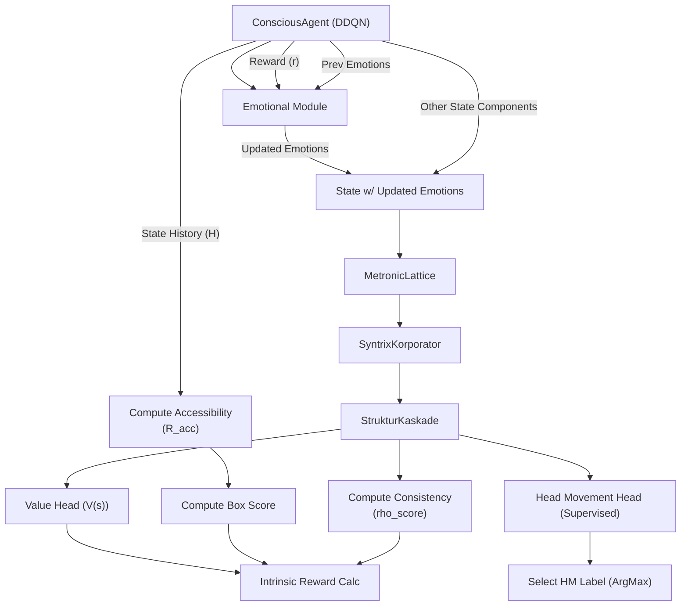
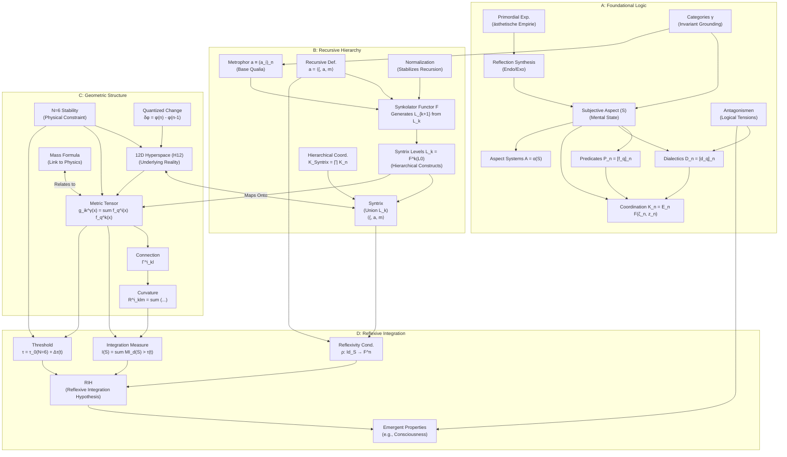

---

# Live2D Avatar AI Agent  
### Powered by the Syntrometrie Framework

Meet a **Live2D Cubism 3** avatar that doesn’t just animate—it *thinks* and *feels*. This project blends real-time animation with a "conscious" AI agent, driven by the innovative **Syntrometrie framework**. Chat with it, and watch it respond with dynamic **expressions** and **head movements**, all refined through reinforcement learning. Built on a stack of **PyTorch**, **PyQt5/OpenGL**, `live2d-py`, `sentence-transformers`, and `tokenizers`.

---

## 🌟 What’s It All About?

This is where AI meets emotional intelligence in a virtual companion. It’s a playground for AI enthusiasts, animators, and developers to experiment with reinforcement learning, natural language processing (NLP), and Live2D animation. The result? A responsive, emotionally aware avatar that evolves with every interaction.

---

## 🚀 Key Features

- **Syntrometrie Framework**:  
  - *Metronic Lattice*: Discretizes states for efficient mapping.  
  - *Syntrix Korporator*: Shapes the agent’s belief system.  
  - *Struktur Kaskade*: Links reasoning steps seamlessly.  
- **Dynamic Responses**: Combines emotional states with optional text embeddings for depth.  
- **NLP Backbone**:  
  - Lightweight **GPT-style Transformer** for natural chat.  
  - **Sentence Transformers** for rich semantic embeddings.  
  - **BPE Tokenizer** for fast, efficient text processing.  
- **Avatar Animation**:  
  - Procedural effects (breathing, blinking, idle sway).  
  - Emotion-driven expressions and predictive head tilts.  
- **Learning Core**:  
  - **Prioritized Experience Replay (PER)** for smarter reinforcement learning.  
  - Asynchronous training for smooth, lag-free performance.  

---

## 📊 Project Status

- **Current State**: Actively evolving.  
- **Next Steps**:  
  - Enhanced RL algorithms for faster learning.  
  - Expanded movement library for richer animations.  
  - Performance optimizations for real-time responsiveness.  

---

## 🛠️ How It Works

1. **State Initialization**: `EmotionalSpace` sets the emotional tone from chats or events.  
2. **Text Processing**: Optional `SentenceTransformer` embeddings add nuance.  
3. **AI Decision**: `ConsciousAgent` selects actions (e.g., a nod) based on its beliefs.  
4. **Animation**: `Live2DCharacter` renders emotions and motions in real time.  
5. **Learning Loop**: RL refines behavior with PER, running asynchronously for efficiency.  

For a deeper dive into the architecture, check out the [Mermaid Diagrams](#architecture-diagrams).

---

## 🚀 Get Started

### Prerequisites
- **Python**: 3.8+.  
- **Dependencies**:  
  ```bash
  pip install torch numpy PyQt5 PyOpenGL PyOpenGL-accelerate qasync live2d-py[cubism3] tokenizers sentence-transformers
  ```  
- **Live2D Core**: Grab the native library (`.dll`, `.so`, `.dylib`) from [Live2D](https://www.live2d.com/en/). Place it in the project root or system path. See [live2d-py](https://github.com/Arkueid/live2d-py/blob/main/README.en.md) for setup help.

### Setup
1. **Add a Model**:  
   - Drop your Cubism 3 model (e.g., `model.model3.json`) into `./models/`.  
   - Update `GraphicsConfig.MODEL_PATH` in `config.py`.  
2. **Training Data**:  
   - Add `train_data.json` (format below).  
   - Adjust `TRAINING_DATA_PATH` in `config.py` if needed.  

### Run It
```bash
python main.py
```  
- **Controls**:  
  - `Space`: Toggle pause/play.  
  - `Q`/`Esc`: Exit.  
  - `C`: Check completeness.  
  - Chat via the GUI.  

---

## 🧩 Core Components

| File             | Purpose                                                      |
|------------------|-------------------------------------------------------------|
| `config.py`      | Central hub for agent, RL, NLP, graphics, and env settings. |
| `agent.py`       | `ConsciousAgent`: Drives RL and movement predictions.       |
| `environment.py` | `EmotionalSpace`: Simulates emotional context.              |
| `ai_modules.py`  | PyTorch modules: `EmotionalModule`, `SimpleGPT`, and more.  |
| `graphics.py`    | `Live2DCharacter`: Powers real-time animations.             |
| `gui_widgets.py` | HUD and state panel widgets for the GUI.                    |
| `main_gui.py`    | Main window with the update loop.                           |
| `orchestrator.py`| Syncs agent, environment, and avatar.                       |
| `utils.py`       | Helpers, `Experience` class, and PER memory logic.          |
| `main.py`        | Entry point with `asyncio` integration.                     |

---

## 📚 Training Data Format

Fuel for the tokenizer, `SimpleGPT`, and movement training:

```json
{
  "situation": "User asks 'how are you?'",
  "output": "I’m feeling awesome, thanks!",
  "emotion_weights": [0.7, 0.2, 0.0, 0.0],  // e.g., [happy, calm, sad, angry]
  "head_movement": "gentle_nod"
}
```

---

## 🎨 Customize It

Tweak `config.py` to:  
- Enable/disable embeddings: `AgentConfig.USE_LANGUAGE_EMBEDDING`.  
- Adjust movement learning: `RLConfig.HEAD_MOVEMENT_LOSS_WEIGHT`.  
- Switch models: `GraphicsConfig.MODEL_PATH`.  

---

## 🖥️ Architecture Diagrams

Below are the key architectural components of the project visualized using **Mermaid diagrams**. These diagrams provide a high-level overview of the system's structure and interactions.

### **1. ConsciousAgent Architecture**



### **2. Syntrometrie Framework**



---

## 📈 Future Work

- **Enhanced RL Algorithms**: Experiment with advanced techniques like Deep Deterministic Policy Gradient (DDPG) or Soft Actor-Critic (SAC).  
- **Expanded Animations**: Add more complex movements and gestures for richer interactions.  
- **Performance Optimizations**: Optimize rendering and training pipelines for real-time performance.  
- **Interdisciplinary Research**: Explore connections to philosophy, neuroscience, and AI ethics.  

---

This README now includes embedded Mermaid diagrams that will render directly on GitHub. Let me know if you'd like further refinements! 🚀
