# Live2D Avatar AI Agent
### Powered by the Syntrometrie Framework

Meet a **Live2D Cubism 3** avatar that doesn’t just animate—it *thinks* and *feels*. This project blends real-time animation with a "conscious" AI agent, driven by the innovative **Syntrometrie framework**. Chat with it, and watch it respond with dynamic **expressions** and **head movements**, all refined through reinforcement learning. Built on a stack of **PyTorch**, **PyQt5/OpenGL**, `live2d-py`, `sentence-transformers`, and `transformers`.

---

## 🌟 What’s It All About?

This is where AI meets emotional intelligence in a virtual companion. It’s a playground for AI enthusiasts, animators, and developers to experiment with reinforcement learning (DDQN, PER), natural language processing (Transformers), and Live2D animation. The result? A responsive, evolving avatar aiming for believable interaction and presence.

---
[Make sure to check out Live-demo!](https://marko0marky.github.io/Live2d-Avatar-Ai/)

## 🚀 Key Features

-   **Syntrometrie-Inspired AI Core**: Custom framework for state processing:
    -   *Metronic Lattice*: Discretizes state.
    *   *Syntrix Korporator*: Composes belief representations.
    *   *Struktur Kaskade*: Propagates belief through layers.
-   **Dynamic Agent State**: Integrates base emotional/environmental state with optional **Sentence Transformer embeddings** derived from text (monologue, user input).
-   **Advanced NLP (Hugging Face Transformers)**:
    *   Utilizes pre-trained models (e.g., `distilgpt2`, `DialoGPT-small`) via the `transformers` library for conversational responses.
    *   Supports **fine-tuning** these models on custom data (script included).
    *   Employs improved **context management** for more relevant replies.
-   **Dynamic Avatar Animation**:
    *   Procedural effects: Breathing, blinking, idle sway, **micro-movements**.
    *   Emotion-driven expressions mapped from agent state.
    *   Agent-predicted **head movements** (nods, tilts, turns) applied in real-time.
    *   Particle system effects influenced by emotions.
-   **Reinforcement Learning System**:
    *   **Double DQN (DDQN)** with target networks for stable value learning.
    *   **Prioritized Experience Replay (PER)** for efficient sample usage.
    *   Supervised learning head for **head movement prediction** trained alongside RL.
    *   Basic **intrinsic rewards** (consistency, stability) included.
    *   **Asynchronous training** via `concurrent.futures` for smooth GUI performance.
-   **Interactive GUI & State Management**:
    *   PyQt5-based interface with OpenGL rendering.
    *   HUD overlay displaying key emotions and RL metrics.
    *   Detailed AI State Panel showing internal metrics, mood, and environment controls.
    *   Live chat interface for user interaction.
    *   Functionality to **save and load** the complete agent state (networks, optimizer, buffer) via GUI buttons or command-line arguments.
*   **Richer Emotions:** Variable decay rates allow different emotions to persist differently.

---

## 📊 Project Status

-   **Current State**: Core components integrated (DDQN, TransformerGPT, Save/Load, HM Prediction). Actively developing.
-   **Next Steps**:
    -   **Critical**: Fine-tune the Transformer GPT model with more data for coherent conversation.
    *   Improve head movement prediction robustness and variety.
    *   Implement comprehensive testing.
    *   Explore performance optimizations.

---

## 🛠️ How It Works (Updated Flow)

1.  **State Generation**: `EmotionalSpace` produces a `base_state`.
2.  **Text Processing**: `Orchestrator` generates monologue/response via `TransformerGPT`. Optional `SentenceTransformer` creates text `embedding`.
3.  **State Combination**: `Orchestrator` combines `base_state` + `embedding` -> `current_state`.
4.  **Agent Processing**: `Agent` processes `current_state` through Syntrometrie modules -> `belief`.
5.  **Prediction**: `Agent` (online nets) predicts `value`, `head_movement_label`.
6.  **Avatar Update**: `Orchestrator` sends predicted `head_movement_label` and `last_response_emotions` to `Live2DCharacter`.
7.  **Experience Storage**: `Orchestrator` stores `Experience` tuple (incl. `head_movement_idx`, TD error) in `MetaCognitiveMemory`.
8.  **Learning Loop (Async)**: `Agent.learn` samples from PER buffer, calculates TD target using **target networks** (DDQN), computes losses (value + HM), updates **online networks**, updates PER priorities, and performs soft update on **target networks**.
9.  **Chat**: User input -> `Orchestrator` -> Embedding/State Update -> Improved Context Prompt -> `TransformerGPT` -> Response -> History Update -> Avatar Emotion/Movement Update.

For a deeper dive into the architecture, check out the [Mermaid Diagrams](#architecture-diagrams).

---

## 🚀 Get Started

### Prerequisites
-   **Python**: 3.8+ recommended.
-   **Dependencies**: Use a virtual environment!
    ```bash
    # Optional: Create and activate venv
    # python -m venv venv
    # source venv/bin/activate  # Linux/macOS
    # .\venv\Scripts\activate  # Windows

    # Install dependencies
    pip install torch numpy PyQt5 PyOpenGL PyOpenGL-accelerate qasync live2d-py[cubism3] tokenizers sentence-transformers transformers datasets accelerate html5lib # Added transformers, datasets, accelerate, html5lib

    # Optional: Create requirements file
    # pip freeze > requirements.txt
    ```
-   **(CRITICAL) Live2D Core**: Download the native Cubism Core library (`.dll`/`.so`/`.dylib`) for your OS from the [Live2D Website](https://www.live2d.com/en/download/cubism-sdk/download-native/) and place it in the project root OR ensure it's discoverable in your system's library path. Check [live2d-py](https://github.com/Arkueid/live2d-py/blob/main/README.en.md) for details.
-   **(Recommended)** **CUDA-enabled GPU**: For reasonable performance, especially for fine-tuning and Sentence Transformer embeddings. Ensure matching PyTorch CUDA version.

### Setup
1.  **Live2D Model**: Place your Cubism **3** model files (e.g., `*.model3.json`) inside the `./models/` directory. Update `GraphicsConfig.MODEL_PATH` in `config.py` if needed.
2.  **Training Data**: Place `train_data.json` (or the provided `train_data_anime_girl.json`, renamed) in the project root. Ensure it follows the format specified below. Update `TRAINING_DATA_PATH` in `config.py` if using a different name.
3.  **Create Directories**: Manually create `./tokenizer` and `./saved_models` folders in the project root if they don't exist.

### Running
1.  **(Optional but HIGHLY Recommended) Fine-tune GPT Model:**
    *   Prepare a suitable training dataset (`train_data.json` or ideally, a larger custom one).
    *   Ensure you have a CUDA-enabled GPU and compatible PyTorch/CUDA installed.
    *   Run the fine-tuning script: `python fine_tune_gpt.py`
    *   This saves the fine-tuned model to the directory specified by `GPT_SAVE_PATH` in `config.py` (e.g., `./saved_models/distilgpt2_finetuned`).
2.  **Run the Main Application:**
    ```bash
    # Run normally (loads fine-tuned GPT if found, else base)
    python main.py

    # Run and load previously saved agent state (if available)
    python main.py --load

    # Automatically save agent state on exit
    python main.py --save-on-exit
    ```
-   **Controls**: `Space` (Pause/Resume), `Q`/`Esc` (Quit), `C` (Completeness Test), `Save Agent`/`Load Agent` buttons, Chat Input + `Enter`.

---

## 🧩 Core Components

| File                | Role                                                                                                |
|---------------------|-----------------------------------------------------------------------------------------------------|
| `config.py`         | Central config (dataclasses), constants, paths, data loading/validation, save paths.               |
| `agent.py`          | `ConsciousAgent`: Core RL (DDQN+PER), HM prediction, state processing, save/load logic.             |
| `environment.py`    | `EmotionalSpace`: Simulates base state, internal events, keyword impact.                          |
| `ai_modules.py`     | PyTorch modules: `EmotionalModule` (variable decay), `SyntrixKorporator`, `StrukturKaskade`, `TransformerGPT`. |
| `graphics.py`       | `Live2DCharacter`: Live2D rendering, animation, applies predicted movements.                          |
| `gui_widgets.py`    | `HUDWidget` & `AIStateWidget` UI elements.                                                            |
| `main_gui.py`       | Main application window (`EnhancedGameGUI`), integrates UI components, handles user input/controls. |
| `orchestrator.py`   | `EnhancedConsciousAgent`: Coordinates modules, handles chat, async learning, save/load calls.       |
| `utils.py`          | Helpers (`is_safe`), `Experience` tuple, `MetronicLattice`, `MetaCognitiveMemory` (PER), BPE tokenizer logic. |
| `main.py`           | Application entry point, `asyncio`/`qasync` setup, argument parsing, initializers.                  |
| `fine_tune_gpt.py`  | **(New)** Standalone script for fine-tuning the Hugging Face GPT model.                             |

---

## 📚 Training Data Format

Used for BPE Tokenizer (optional), GPT Fine-tuning, and Head Movement Training.

**Required:** `"output"` (string)
**Optional:**
-   `"situation"` (string): Context for the output.
-   `"emotion_weights"` (list of 4 floats): Used for legacy SimpleGPT bias (less relevant now).
-   `"head_movement"` (string): Target label (must be in `config.py:HEAD_MOVEMENT_LABELS`).

Example:
```json
{
  "situation": "User asks 'how are you?'",
  "output": "I’m feeling great, thanks for asking!",
  "emotion_weights": [0.8, 0.0, 0.1, 0.0],
  "head_movement": "gentle_nod"
}
```

---

## 🎨 Customize It

Tweak `config.py`:
-   `NLPConfig.HUGGINGFACE_MODEL`: Change base Transformer model (e.g., `"gpt2"`, `"microsoft/DialoGPT-small"`).
-   `AgentConfig.USE_LANGUAGE_EMBEDDING`: Toggle sentence embeddings.
-   `RLConfig.HEAD_MOVEMENT_LOSS_WEIGHT`: Tune HM training.
-   `RLConfig.TARGET_NETWORK_SOFT_UPDATE_TAU`: Modify target network update speed.
-   `GraphicsConfig.MODEL_PATH`: Set your Live2D model.
-   Learning rates, memory sizes, thresholds, etc.

---

## 🖥️ Architecture Diagrams

*(These provide a high-level conceptual overview)*

### 1. Core Agent Loop & Interaction


### 2. Syntrometrie Framework (Conceptual)

```mermaid
graph TD
    %% Foundational Layer
    subgraph "A: Foundational Logic"
        A1["Primordial Exp.\n(ästhetische Empirie)"] --> A2["Reflection Synthesis\n(Endo/Exo)"]
        A2 --> A3["Subjective Aspect (S)\n(Mental State)"]
        A3 --> A4["Predicates P_n = [f_q]_n"]
        A3 --> A5["Dialectics D_n = [d_q]_n"]
        A3 --> A6["Coordination K_n = E_n F(ζ_n, z_n)"]
        A4 --> A6
        A5 --> A6
        A7["Antagonismen\n(Logical Tensions)"] --> A5
        A3 --> A8["Aspect Systems A = α(S)"]
        A9["Categories γ\n(Invariant Grounding)"] --> A3
    end

    %% Recursive Structure Layer
    subgraph "B: Recursive Hierarchy"
        B1["Metrophor a ≡ (a_i)_n\n(Base Qualia)"] --> B2["Synkolator Functor F\nGenerates L_{k+1} from L_k"]
        B2 --> B3["Syntrix Levels L_k = F^k(L0)\n(Hierarchical Constructs)"]
        B3 --> B4["Syntrix\n(Union L_k)\n⟨{, a, m⟩"]
        B5["Recursive Def.\na = ⟨{, a, m⟩"] --> B2
        B6["Normalization\n(Stabilizes Recursion)"] --> B2
        B7["Hierarchical Coord.\nK_Syntrix = ∏ K_n"] --> B4
        A9 --> B1
    end

    %% Geometric Layer
    subgraph "C: Geometric Structure"
        C1["12D Hyperspace (H12)\n(Underlying Reality)"] <-->|"Maps Onto"| B4
        C2["N=6 Stability\n(Physical Constraint)"] --> C1
        C1 --> C3["Metric Tensor\ng_ik^γ(x) = sum f_q^i(x) f_q^k(x)"]
        C3 --> C4["Connection\nΓ^i_kl"]
        C4 --> C5["Curvature\nR^i_klm = sum (...)"]
        C6["Quantized Change\nδφ = φ(n) - φ(n-1)"] --> C1
        B3 --> C3
        C2 --> C3
        C7["Mass Formula\n(Link to Physics)"] <-- "Relates to" --> C3
    end

    %% Emergence Layer
    subgraph "D: Reflexive Integration"
        D1["RIH\n(Reflexive Integration Hypothesis)"]
        C3 --> D2["Integration Measure\nI(S) = sum MI_d(S) > τ(t)"]
        C5 --> D2
        B4 --> D3["Reflexivity Cond.\nρ: Id_S → F^n"]
        B5 --> D3
        C2 --> D4["Threshold\nτ = τ_0(N=6) + Δτ(t)"]
        C3 --> D4
        D2 --> D1
        D3 --> D1
        D4 --> D1
        D1 --> D5["Emergent Properties\n(e.g., Consciousness)"]
        A7 --> D5
    end
```


[Syntrometrie Framework Pdf](https://github.com/Marko0Marky/Live2d-Avatar-Ai/blob/main/research/Syntrometry.pdf)
---

## 📈 Future Work

-   **Enhanced RL**: Explore advanced algorithms (PPO, SAC), intrinsic motivation (ICM/RND).
-   **Improved Non-Verbal**: Implement lip-sync, advanced eye gaze, RL for movement generation.
-   **Performance**: Profiling and optimization (JIT, AMP, rendering).
-   **Testing & Refactoring**: Increase code coverage and improve modularity.
-   **Voice I/O**: Integrate STT and TTS.
-   **Interdisciplinary**: Explore connections to cognitive science, philosophy.

---

## 🤝 Contributing

Contributions are welcome! Please follow standard GitHub flow:
1.  Fork the repository.
2.  Create a new branch (`git checkout -b feature/YourFeature`).
3.  Commit your changes (`git commit -am 'Add some feature'`).
4.  Push to the branch (`git push origin feature/YourFeature`).
5.  Open a Pull Request.

---

## ❓ Questions?

Feel free to open an issue on GitHub if you encounter problems or have suggestions!

---

<!-- Optional: Add a GIF or screenshot link here -->
<!--  -->

<!-- Optional: Add License -->
<!-- ## License -->
<!-- This project is licensed under the MIT License - see the LICENSE file for details. -->
